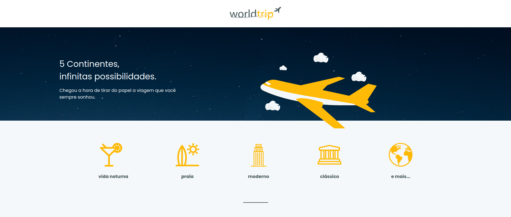
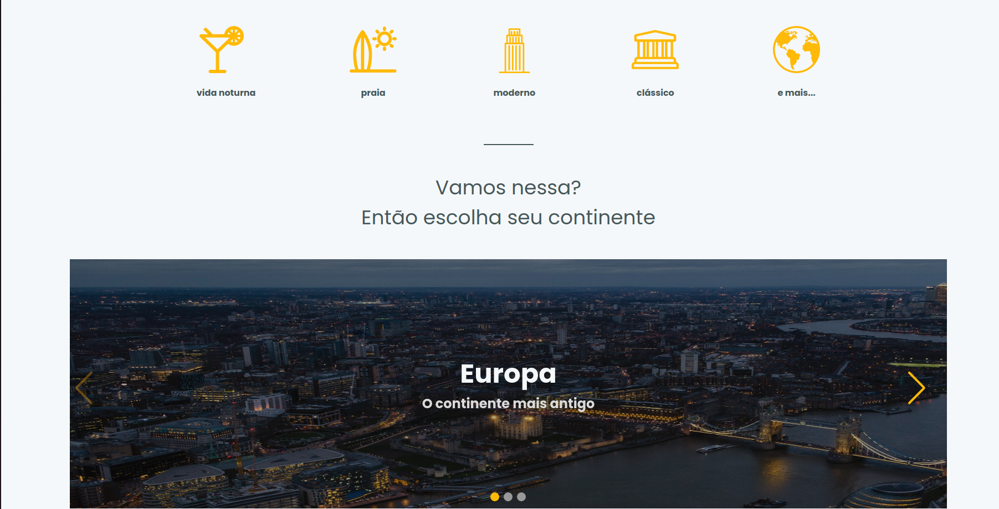
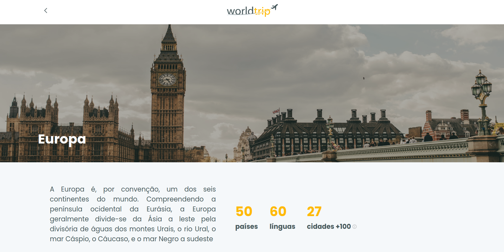
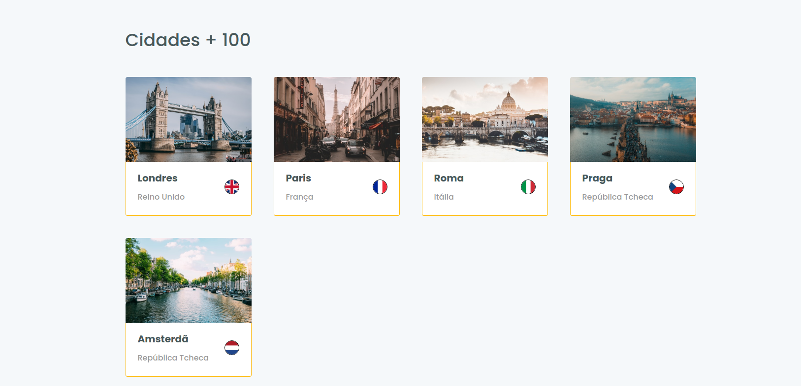
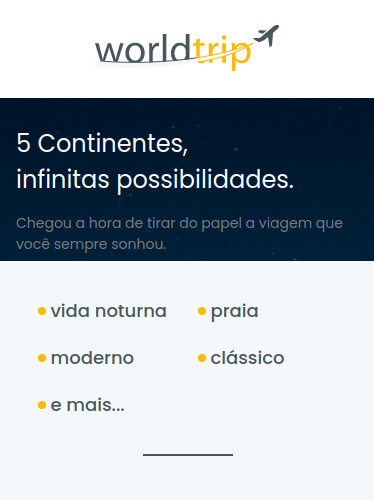
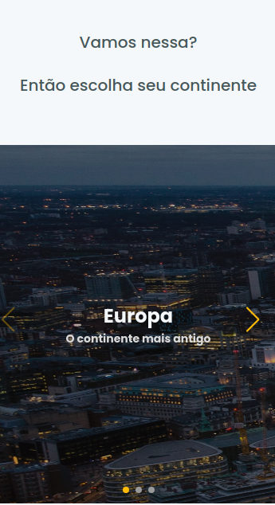

<h1 align="center">
  World trip
</h1>

- - -

<h1 align="center" >Preview Web</h1>

 
  

 
  

 
  

 
  

 

<h1 align="center" >Preview Mobile</h1>

 
  

 
  

 
  

 
  

 

## Tecnologias

 Esse projeto foi desenvolvido com as seguintes tecnologias:

- NEXTJS
- CHAKRA UI
- TYPESCRIPT
  
## Projeto

 Caso queira rodar essa aplicação em sua máquina, basta usar os comandos: 

 - yarn 
 - yarn run dev